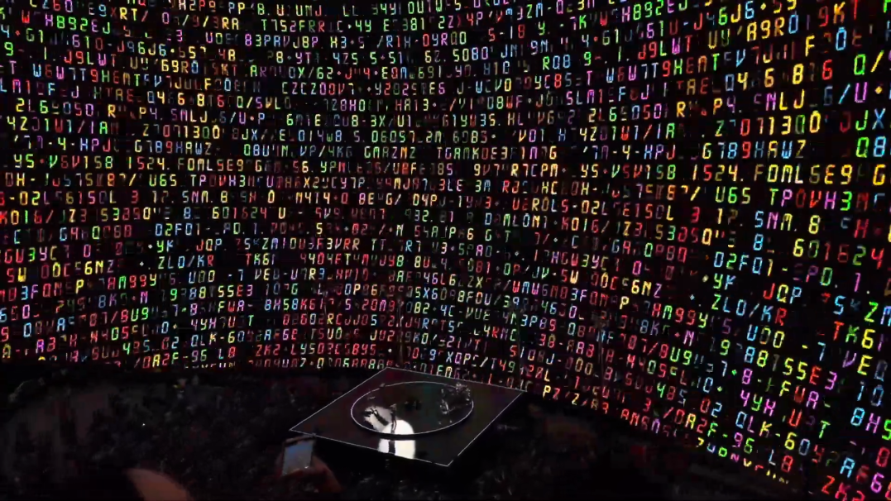

# Rainbow JS inspired by the Las Vegas Sphere

Inspired by the newly created Las Vegas Sphere, I decided to create a replication inside the terminal.
I did this by using ANSI escape sequences within javscript, you can run this code by doing the following
```node rainbow.js```
This was mainly created for personal use, I am using this on windows powershell, linux terminal should be
supported due to the ANSI escape sequences being non-OS specific. References of the sphere, and my output
below.



Note that the characters are constantly changing, this is just a snapshot of it.
